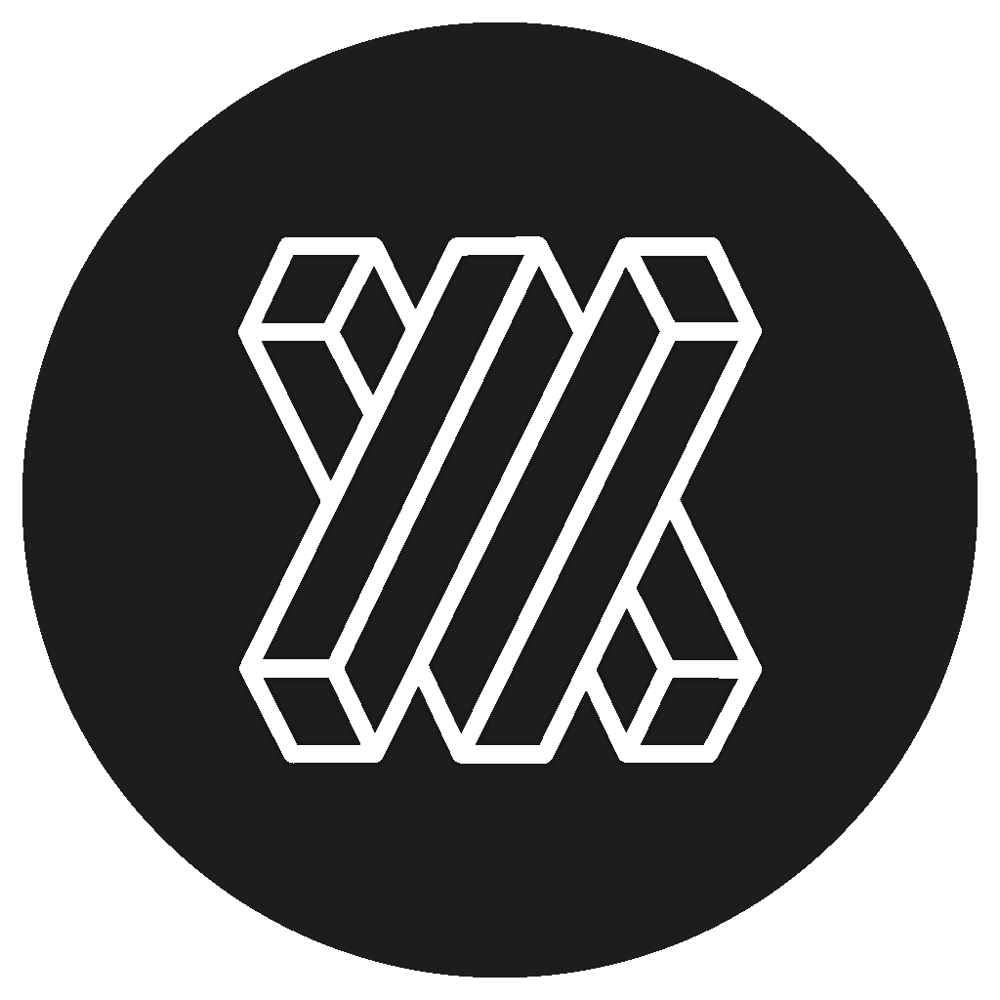
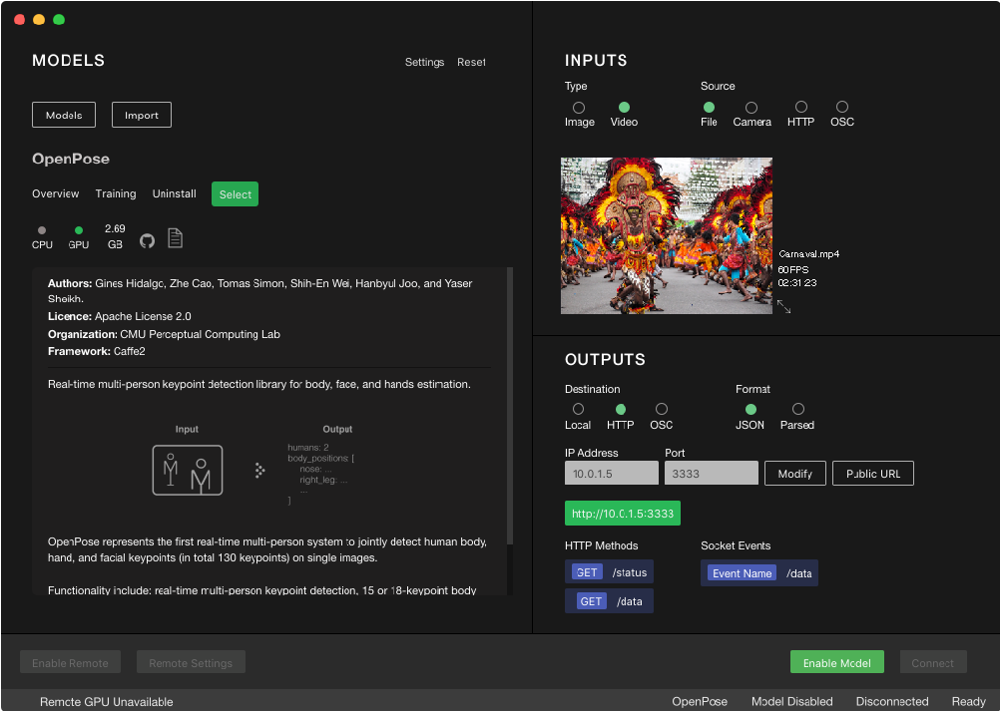

  

<h1 align="center">Runway: Machine Learning for Everyone</h1>

  
  
  

## Introduction

[Runway](https://runwayml.com/) is desktop application that allows to easily run state of the art machine learning models and use them in creative and interactive ways. You can connect this models to other applications via OSC, Sockets or HTTP networks.

  

## Features

- Run state of the art machine learning models with one click
- Connect it to any software via OSC or HTTP (See examples with [Processing](https://github.com/runwayml/examples_processing), [Unity](https://github.com/runwayml/examples_unity), [MAX/MSP](https://github.com/runwayml/examples_maxmsp), [Arduino](https://github.com/runwayml/examples_arduino), [JavaScript](https://github.com/runwayml/examples_javascript), [OpenFrameworks](https://github.com/runwayml/examples_openFrameworks) and [TouchDesigner](https://github.com/runwayml/examples_touchDesigner))
- Preprocess video stream for interactive projects
- Input/Output Flexibility: mix and match your inputs and outputs.
- Run locally (CPU/GPU) or remotely in GPUs with virtual machines via PaperSpace, AWS or Google Cloud

## Why Runway?

While commercial applications of machine learning can be found everywhere, experimentation of new prototypes and techniques remains - for the most- confined to computer scientists or engineers and has a limited reach to other fields. 

This project is an attempt to make machine learning models and ML related tools more accessible to artist, designers and anyone curious about this topic.

## Getting Started

Download the latest version from Runway's main website ([runwayml.com](https://runwayml.com/)) and [follow the setup instructions](https://runwayml.com/docs/install/).

### Tutorials
 - [Getting Started](https://runwayml.com/tutorials/getting-started/)
 - Input/Output
 - Using Sockets
 - Using OSC

### Software Examples
  - [Processing](https://github.com/runwayml/examples_processing)
  - [Unity](https://github.com/runwayml/examples_unity)
  - [MAX/MSP](https://github.com/runwayml/examples_maxmsp)
  - [Arduino](https://github.com/runwayml/examples_arduino)
  - [JavaScript](https://github.com/runwayml/examples_javascript)
  - [OpenFrameworks](https://github.com/runwayml/examples_openFrameworks)
  - [TouchDesigner](https://github.com/runwayml/examples_touchDesigner)

### Gallery
  - [SideWalk Orchestra](https://github.com/cvalenzuela/sidewalk_orchestra)

## How it works

More on this soon!

## Roadmap

- Support for sound and text based models (help wanted)
- Add basic tensorflow.js functionality for transfer learning capabilities
- Add CI and Tests

## Contributing

This is a project in active development. If you are interested in contributing, please do!
Help is needed developing the app, adding new models and developing examples and tutorials!

See [CONTRIBUTING](CONTRIBUTING.md)
